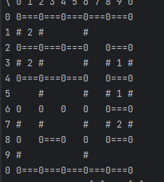

不断与强棋对弈，从输的对局中发现问题：
hash表
终局全吃子的方法,当遇到环,固定双交了，而事实是当环的数量够多，应当全吃9       √
搜索时长需要优化（不固定，按照Turn）
TurnMark增加TurnMark3,前中期让子，只搜3，4自由度
撤子功能
前端提示落子功能
打谱
走链如果默认最小，会出现有环和链的组合边的下哪条链的问题                   √
终局不模拟扩展到终局，随机会有影响
getFrontMove 有的版本忘记更改
